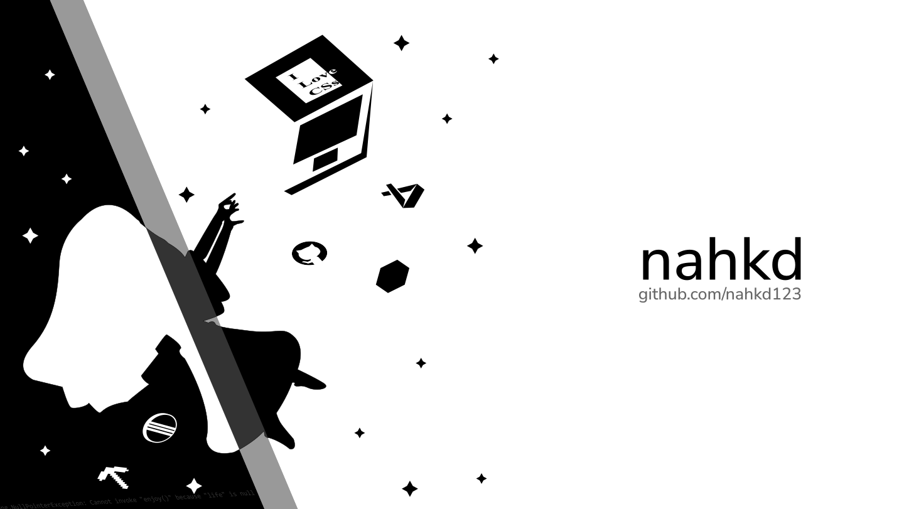

Welcome to my GitHub profile! I don't have much stuff to share in here but whatever. GitHub profile banner cooked by me using Inkscape.

## Quick Links
[GitHub](https://github.com/nahkd123) | [circle clicking profile omg this is depressing](https://osu.ppy.sh/users/12607531)

## General Info
- Living somewhere in Hanoi, Vietnam.
- Tends to reinvent the wheel.

## Skills
### Overview
- [Java](#skills-java)
- [Web Development](#skills-web)
- [Other Skills](#skills-misc)

### Java <a id="skills-java"/>
- Bukkit plugins development
- ~~A bit of~~ Fabric mods development
- Use Java for stuffs other than Minecraft as well

### Web <a id="skills-web"/>
- TypeScript (basically JavaScript but better)
- SCSS (basically CSS but better)
- Used to use Vue but then I moved to Svelte

### Misc <a id="skills-misc"/>
- Designing
  + Inkscape
  + Figma (for UI designs mostly)
- Ability to use Stack Overflow.

## My projects that I think they are cool <a id="cool-projects"/>
- [Mixery](https://github.com/MixeryOSS/Mixery): Digital audio workspace that runs in your browser, so Chromebook users can brag about how their laptop is still useful. Don't have time to maintain it right now.
- [Serarif](https://github.com/nahkd123/Serarif): Sans serif font. Basically my attempt to make the font that appears in my dream. Not perfect but I think it's decent.

## Contact
- Email address: You can find my email address by looking at my GPG signature. I usually check my inbox everyday or two (or maybe longer, I don't know to be honest).
- Twitter: ~~Honestly I don't use Twitter much nowadays, but if you want, you can visit my Twitter profile with the link above.~~ nahh I think it should be gone for real.
- GitHub: You can drop a message [here](https://github.com/nahkd123/nahkd123/issues). Note that everyone can see your message there so please avoid posting personal information.
